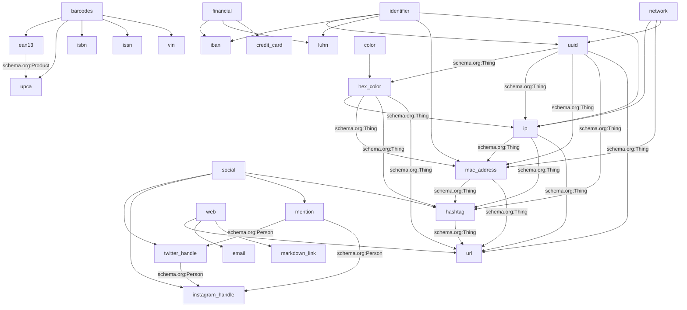

# Validator Reference
> **DRY, Doc-Driven, and Always In Sync!**
> This documentation is auto-generated from the single source of truth: `VALIDATOR_EXAMPLES`.
> All validator logic, tests, and docs are always in sync. To add or update a validator, just edit `VALIDATOR_EXAMPLES`.
> **Warning:** Drift detected!
>
> The following issues were found and must be fixed for full DRYness and test coverage:
>
> - Missing validator classes: isbn, vin, issn, iban, luhn, ean13, upca, uuid, hex_color, ip, mac_address, hashtag, mention, twitter_handle, instagram_handle, url
>
> Please update the codebase so all validators in VALIDATOR_EXAMPLES have a class and (if needed) a regex.
>
> **Note:** This documentation is the source of truth for both the API and automated tests. All examples below are used as test scenarios and match the API structure.
This file is auto-generated from the gem's DRY validator structure.
[Usage Guide](usage.md) | [API Reference](api.markdown)

## Validator Relationships

## `isbn`
- **Schema.org Type:** [`Book`](https://schema.org/Book)
- **Schema.org Property:** [`isbn`](https://schema.org/isbn)
- **Description:** International Standard Book Number (schema.org/Book/isbn)
- **Valid examples:** `978-3-16-148410-0`, `0-306-40615-2`
- **Invalid examples:** `978-3-16-148410-1`, `123`
- **See also (group):** [`ean13`](#ean13), [`upca`](#upca), [`issn`](#issn), [`vin`](#vin)
- **API endpoint:** [`POST /validators/isbn/validate`](api.markdown#validatorsidvalidate)
- **Usage example:** [Usage Guide](usage.md#using-validators-in-rails-models)

### Test Scenarios
| Input | Expected Result | Example API Request | Example API Response |
|-------|----------------|--------------------|---------------------|
| `978-3-16-148410-0` | ✅ valid | <pre>{"value": "978-3-16-148410-0"}</pre> | <pre>{"valid": true, "errors": []}</pre> |
| `0-306-40615-2` | ✅ valid | <pre>{"value": "0-306-40615-2"}</pre> | <pre>{"valid": true, "errors": []}</pre> |
| `978-3-16-148410-1` | ❌ invalid | <pre>{"value": "978-3-16-148410-1"}</pre> | <pre>{"valid": false, "errors": ["..."]}</pre> |
| `123` | ❌ invalid | <pre>{"value": "123"}</pre> | <pre>{"valid": false, "errors": ["..."]}</pre> |

## `vin`
- **Schema.org Type:** [`Vehicle`](https://schema.org/Vehicle)
- **Schema.org Property:** [`vehicleIdentificationNumber`](https://schema.org/vehicleIdentificationNumber)
- **Description:** Vehicle Identification Number (schema.org/Vehicle/vehicleIdentificationNumber)
- **Regex:** `VIN_REGEX`
- **Valid examples:** `1HGCM82633A004352`
- **Invalid examples:** `1HGCM82633A004353`, `123`
- **See also (group):** [`ean13`](#ean13), [`upca`](#upca), [`isbn`](#isbn), [`issn`](#issn)
- **API endpoint:** [`POST /validators/vin/validate`](api.markdown#validatorsidvalidate)
- **Usage example:** [Usage Guide](usage.md#using-validators-in-rails-models)

### Test Scenarios
| Input | Expected Result | Example API Request | Example API Response |
|-------|----------------|--------------------|---------------------|
| `1HGCM82633A004352` | ✅ valid | <pre>{"value": "1HGCM82633A004352"}</pre> | <pre>{"valid": true, "errors": []}</pre> |
| `1HGCM82633A004353` | ❌ invalid | <pre>{"value": "1HGCM82633A004353"}</pre> | <pre>{"valid": false, "errors": ["..."]}</pre> |
| `123` | ❌ invalid | <pre>{"value": "123"}</pre> | <pre>{"valid": false, "errors": ["..."]}</pre> |

## `issn`
- **Schema.org Type:** [`PublicationIssue`](https://schema.org/PublicationIssue)
- **Schema.org Property:** [`issn`](https://schema.org/issn)
- **Description:** International Standard Serial Number (schema.org/PublicationIssue/issn)
- **Valid examples:** `2049-3630`
- **Invalid examples:** `2049-3631`, `123`
- **See also (group):** [`ean13`](#ean13), [`upca`](#upca), [`isbn`](#isbn), [`vin`](#vin)
- **API endpoint:** [`POST /validators/issn/validate`](api.markdown#validatorsidvalidate)
- **Usage example:** [Usage Guide](usage.md#using-validators-in-rails-models)

### Test Scenarios
| Input | Expected Result | Example API Request | Example API Response |
|-------|----------------|--------------------|---------------------|
| `2049-3630` | ✅ valid | <pre>{"value": "2049-3630"}</pre> | <pre>{"valid": true, "errors": []}</pre> |
| `2049-3631` | ❌ invalid | <pre>{"value": "2049-3631"}</pre> | <pre>{"valid": false, "errors": ["..."]}</pre> |
| `123` | ❌ invalid | <pre>{"value": "123"}</pre> | <pre>{"valid": false, "errors": ["..."]}</pre> |

## `iban`
- **Schema.org Type:** [`BankAccount`](https://schema.org/BankAccount)
- **Schema.org Property:** [`identifier`](https://schema.org/identifier)
- **Description:** International Bank Account Number (no direct schema.org property, using identifier)
- **Regex:** `IBAN_REGEX`
- **Valid examples:** `GB82WEST12345698765432`
- **Invalid examples:** `GB82WEST12345698765431`, `123`
- **See also (group):** [`luhn`](#luhn), [`credit_card`](#credit_card), [`uuid`](#uuid), [`mac_address`](#mac_address), [`ip`](#ip)
- **API endpoint:** [`POST /validators/iban/validate`](api.markdown#validatorsidvalidate)
- **Usage example:** [Usage Guide](usage.md#using-validators-in-rails-models)

### Test Scenarios
| Input | Expected Result | Example API Request | Example API Response |
|-------|----------------|--------------------|---------------------|
| `GB82WEST12345698765432` | ✅ valid | <pre>{"value": "GB82WEST12345698765432"}</pre> | <pre>{"valid": true, "errors": []}</pre> |
| `GB82WEST12345698765431` | ❌ invalid | <pre>{"value": "GB82WEST12345698765431"}</pre> | <pre>{"valid": false, "errors": ["..."]}</pre> |
| `123` | ❌ invalid | <pre>{"value": "123"}</pre> | <pre>{"valid": false, "errors": ["..."]}</pre> |

## `luhn`
- **Schema.org Type:** [`CreditCard`](https://schema.org/CreditCard)
- **Schema.org Property:** [`identifier`](https://schema.org/identifier)
- **Description:** Credit card number (schema.org/CreditCard/identifier, Luhn validated)
- **Regex:** `CREDIT_CARD_REGEX`
- **Valid examples:** `4111 1111 1111 1111`, `79927398713`
- **Invalid examples:** `4111 1111 1111 1112`, `123`
- **See also (group):** [`iban`](#iban), [`credit_card`](#credit_card), [`uuid`](#uuid), [`mac_address`](#mac_address), [`ip`](#ip)
- **API endpoint:** [`POST /validators/luhn/validate`](api.markdown#validatorsidvalidate)
- **Usage example:** [Usage Guide](usage.md#using-validators-in-rails-models)

### Test Scenarios
| Input | Expected Result | Example API Request | Example API Response |
|-------|----------------|--------------------|---------------------|
| `4111 1111 1111 1111` | ✅ valid | <pre>{"value": "4111 1111 1111 1111"}</pre> | <pre>{"valid": true, "errors": []}</pre> |
| `79927398713` | ✅ valid | <pre>{"value": "79927398713"}</pre> | <pre>{"valid": true, "errors": []}</pre> |
| `4111 1111 1111 1112` | ❌ invalid | <pre>{"value": "4111 1111 1111 1112"}</pre> | <pre>{"valid": false, "errors": ["..."]}</pre> |
| `123` | ❌ invalid | <pre>{"value": "123"}</pre> | <pre>{"valid": false, "errors": ["..."]}</pre> |

## `ean13`
- **Schema.org Type:** [`Product`](https://schema.org/Product)
- **Schema.org Property:** [`gtin13`](https://schema.org/gtin13)
- **Description:** EAN-13 barcode (schema.org/Product/gtin13)
- **Regex:** `EAN13_REGEX`
- **Valid examples:** `4006381333931`
- **Invalid examples:** `4006381333932`, `123`
- **See also (group):** [`upca`](#upca), [`isbn`](#isbn), [`issn`](#issn), [`vin`](#vin)
- **See also (schema.org):** [`upca`](#upca)
- **API endpoint:** [`POST /validators/ean13/validate`](api.markdown#validatorsidvalidate)
- **Usage example:** [Usage Guide](usage.md#using-validators-in-rails-models)

### Test Scenarios
| Input | Expected Result | Example API Request | Example API Response |
|-------|----------------|--------------------|---------------------|
| `4006381333931` | ✅ valid | <pre>{"value": "4006381333931"}</pre> | <pre>{"valid": true, "errors": []}</pre> |
| `4006381333932` | ❌ invalid | <pre>{"value": "4006381333932"}</pre> | <pre>{"valid": false, "errors": ["..."]}</pre> |
| `123` | ❌ invalid | <pre>{"value": "123"}</pre> | <pre>{"valid": false, "errors": ["..."]}</pre> |

## `upca`
- **Schema.org Type:** [`Product`](https://schema.org/Product)
- **Schema.org Property:** [`gtin12`](https://schema.org/gtin12)
- **Description:** UPC-A barcode (schema.org/Product/gtin12)
- **Regex:** `UPCA_REGEX`
- **Valid examples:** `036000291452`
- **Invalid examples:** `036000291453`, `123`
- **See also (group):** [`ean13`](#ean13), [`isbn`](#isbn), [`issn`](#issn), [`vin`](#vin)
- **See also (schema.org):** [`ean13`](#ean13)
- **API endpoint:** [`POST /validators/upca/validate`](api.markdown#validatorsidvalidate)
- **Usage example:** [Usage Guide](usage.md#using-validators-in-rails-models)

### Test Scenarios
| Input | Expected Result | Example API Request | Example API Response |
|-------|----------------|--------------------|---------------------|
| `036000291452` | ✅ valid | <pre>{"value": "036000291452"}</pre> | <pre>{"valid": true, "errors": []}</pre> |
| `036000291453` | ❌ invalid | <pre>{"value": "036000291453"}</pre> | <pre>{"valid": false, "errors": ["..."]}</pre> |
| `123` | ❌ invalid | <pre>{"value": "123"}</pre> | <pre>{"valid": false, "errors": ["..."]}</pre> |

## `uuid`
- **Schema.org Type:** [`Thing`](https://schema.org/Thing)
- **Schema.org Property:** [`identifier`](https://schema.org/identifier)
- **Description:** UUID (schema.org/Thing/identifier)
- **Regex:** `UUID_REGEX`
- **Valid examples:** `123e4567-e89b-12d3-a456-426614174000`
- **Invalid examples:** `123e4567-e89b-12d3-a456-42661417400Z`, `123`
- **See also (group):** [`ip`](#ip), [`mac_address`](#mac_address), [`iban`](#iban), [`luhn`](#luhn)
- **See also (schema.org):** [`hex_color`](#hex_color), [`ip`](#ip), [`mac_address`](#mac_address), [`hashtag`](#hashtag), [`url`](#url)
- **API endpoint:** [`POST /validators/uuid/validate`](api.markdown#validatorsidvalidate)
- **Usage example:** [Usage Guide](usage.md#using-validators-in-rails-models)

### Test Scenarios
| Input | Expected Result | Example API Request | Example API Response |
|-------|----------------|--------------------|---------------------|
| `123e4567-e89b-12d3-a456-426614174000` | ✅ valid | <pre>{"value": "123e4567-e89b-12d3-a456-426614174000"}</pre> | <pre>{"valid": true, "errors": []}</pre> |
| `123e4567-e89b-12d3-a456-42661417400Z` | ❌ invalid | <pre>{"value": "123e4567-e89b-12d3-a456-42661417400Z"}</pre> | <pre>{"valid": false, "errors": ["..."]}</pre> |
| `123` | ❌ invalid | <pre>{"value": "123"}</pre> | <pre>{"valid": false, "errors": ["..."]}</pre> |

## `hex_color`
- **Schema.org Type:** [`Thing`](https://schema.org/Thing)
- **Schema.org Property:** [`color`](https://schema.org/color)
- **Description:** Hex color (schema.org/Thing/color)
- **Regex:** `HEX_COLOR_REGEX`
- **Valid examples:** `#fff`, `#abcdef`
- **Invalid examples:** `#ggg`, `123`
- **See also (schema.org):** [`uuid`](#uuid), [`ip`](#ip), [`mac_address`](#mac_address), [`hashtag`](#hashtag), [`url`](#url)
- **API endpoint:** [`POST /validators/hex_color/validate`](api.markdown#validatorsidvalidate)
- **Usage example:** [Usage Guide](usage.md#using-validators-in-rails-models)

### Test Scenarios
| Input | Expected Result | Example API Request | Example API Response |
|-------|----------------|--------------------|---------------------|
| `#fff` | ✅ valid | <pre>{"value": "#fff"}</pre> | <pre>{"valid": true, "errors": []}</pre> |
| `#abcdef` | ✅ valid | <pre>{"value": "#abcdef"}</pre> | <pre>{"valid": true, "errors": []}</pre> |
| `#ggg` | ❌ invalid | <pre>{"value": "#ggg"}</pre> | <pre>{"valid": false, "errors": ["..."]}</pre> |
| `123` | ❌ invalid | <pre>{"value": "123"}</pre> | <pre>{"valid": false, "errors": ["..."]}</pre> |

## `ip`
- **Schema.org Type:** [`Thing`](https://schema.org/Thing)
- **Schema.org Property:** [`identifier`](https://schema.org/identifier)
- **Description:** IPv4 address (schema.org/Thing/identifier)
- **Regex:** `IP_REGEX`
- **Valid examples:** `192.168.1.1`
- **Invalid examples:** `999.999.999.999`, `abc`
- **See also (group):** [`mac_address`](#mac_address), [`uuid`](#uuid), [`iban`](#iban), [`luhn`](#luhn)
- **See also (schema.org):** [`uuid`](#uuid), [`hex_color`](#hex_color), [`mac_address`](#mac_address), [`hashtag`](#hashtag), [`url`](#url)
- **API endpoint:** [`POST /validators/ip/validate`](api.markdown#validatorsidvalidate)
- **Usage example:** [Usage Guide](usage.md#using-validators-in-rails-models)

### Test Scenarios
| Input | Expected Result | Example API Request | Example API Response |
|-------|----------------|--------------------|---------------------|
| `192.168.1.1` | ✅ valid | <pre>{"value": "192.168.1.1"}</pre> | <pre>{"valid": true, "errors": []}</pre> |
| `999.999.999.999` | ❌ invalid | <pre>{"value": "999.999.999.999"}</pre> | <pre>{"valid": false, "errors": ["..."]}</pre> |
| `abc` | ❌ invalid | <pre>{"value": "abc"}</pre> | <pre>{"valid": false, "errors": ["..."]}</pre> |

## `mac_address`
- **Schema.org Type:** [`Thing`](https://schema.org/Thing)
- **Schema.org Property:** [`identifier`](https://schema.org/identifier)
- **Description:** MAC address (schema.org/Thing/identifier)
- **Regex:** `MAC_ADDRESS_REGEX`
- **Valid examples:** `00:1A:2B:3C:4D:5E`
- **Invalid examples:** `00:1A:2B:3C:4D:5Z`, `123`
- **See also (group):** [`ip`](#ip), [`uuid`](#uuid), [`iban`](#iban), [`luhn`](#luhn)
- **See also (schema.org):** [`uuid`](#uuid), [`hex_color`](#hex_color), [`ip`](#ip), [`hashtag`](#hashtag), [`url`](#url)
- **API endpoint:** [`POST /validators/mac_address/validate`](api.markdown#validatorsidvalidate)
- **Usage example:** [Usage Guide](usage.md#using-validators-in-rails-models)

### Test Scenarios
| Input | Expected Result | Example API Request | Example API Response |
|-------|----------------|--------------------|---------------------|
| `00:1A:2B:3C:4D:5E` | ✅ valid | <pre>{"value": "00:1A:2B:3C:4D:5E"}</pre> | <pre>{"valid": true, "errors": []}</pre> |
| `00:1A:2B:3C:4D:5Z` | ❌ invalid | <pre>{"value": "00:1A:2B:3C:4D:5Z"}</pre> | <pre>{"valid": false, "errors": ["..."]}</pre> |
| `123` | ❌ invalid | <pre>{"value": "123"}</pre> | <pre>{"valid": false, "errors": ["..."]}</pre> |

## `hashtag`
- **Schema.org Type:** [`Thing`](https://schema.org/Thing)
- **Schema.org Property:** [`identifier`](https://schema.org/identifier)
- **Description:** Hashtag (no direct schema.org property, using identifier)
- **Regex:** `HASHTAG_PATTERN`
- **Valid examples:** `hashtag`, `test123`
- **Invalid examples:** `#hashtag`, `test 123`, ``
- **See also (group):** [`twitter_handle`](#twitter_handle), [`instagram_handle`](#instagram_handle), [`mention`](#mention)
- **See also (schema.org):** [`uuid`](#uuid), [`hex_color`](#hex_color), [`ip`](#ip), [`mac_address`](#mac_address), [`url`](#url)
- **API endpoint:** [`POST /validators/hashtag/validate`](api.markdown#validatorsidvalidate)
- **Usage example:** [Usage Guide](usage.md#using-validators-in-rails-models)

### Test Scenarios
| Input | Expected Result | Example API Request | Example API Response |
|-------|----------------|--------------------|---------------------|
| `hashtag` | ✅ valid | <pre>{"value": "hashtag"}</pre> | <pre>{"valid": true, "errors": []}</pre> |
| `test123` | ✅ valid | <pre>{"value": "test123"}</pre> | <pre>{"valid": true, "errors": []}</pre> |
| `#hashtag` | ❌ invalid | <pre>{"value": "#hashtag"}</pre> | <pre>{"valid": false, "errors": ["..."]}</pre> |
| `test 123` | ❌ invalid | <pre>{"value": "test 123"}</pre> | <pre>{"valid": false, "errors": ["..."]}</pre> |
| `` | ❌ invalid | <pre>{"value": ""}</pre> | <pre>{"valid": false, "errors": ["..."]}</pre> |

## `mention`
- **Schema.org Type:** [`Person`](https://schema.org/Person)
- **Schema.org Property:** [`identifier`](https://schema.org/identifier)
- **Description:** Mention (no direct schema.org property, using identifier)
- **Regex:** `MENTION_PATTERN`
- **Valid examples:** `mention`, `user123`
- **Invalid examples:** `@mention`, `user name`, ``
- **See also (group):** [`twitter_handle`](#twitter_handle), [`instagram_handle`](#instagram_handle), [`hashtag`](#hashtag)
- **See also (schema.org):** [`twitter_handle`](#twitter_handle), [`instagram_handle`](#instagram_handle)
- **API endpoint:** [`POST /validators/mention/validate`](api.markdown#validatorsidvalidate)
- **Usage example:** [Usage Guide](usage.md#using-validators-in-rails-models)

### Test Scenarios
| Input | Expected Result | Example API Request | Example API Response |
|-------|----------------|--------------------|---------------------|
| `mention` | ✅ valid | <pre>{"value": "mention"}</pre> | <pre>{"valid": true, "errors": []}</pre> |
| `user123` | ✅ valid | <pre>{"value": "user123"}</pre> | <pre>{"valid": true, "errors": []}</pre> |
| `@mention` | ❌ invalid | <pre>{"value": "@mention"}</pre> | <pre>{"valid": false, "errors": ["..."]}</pre> |
| `user name` | ❌ invalid | <pre>{"value": "user name"}</pre> | <pre>{"valid": false, "errors": ["..."]}</pre> |
| `` | ❌ invalid | <pre>{"value": ""}</pre> | <pre>{"valid": false, "errors": ["..."]}</pre> |

## `twitter_handle`
- **Schema.org Type:** [`Person`](https://schema.org/Person)
- **Schema.org Property:** [`sameAs`](https://schema.org/sameAs)
- **Description:** Twitter handle (schema.org/Person/sameAs, for social profile URLs)
- **Regex:** `TWITTER_HANDLE_PATTERN`
- **Valid examples:** `jack`, `user123`
- **Invalid examples:** `user_name_too_long_for_twitter`, ``
- **See also (group):** [`instagram_handle`](#instagram_handle), [`mention`](#mention), [`hashtag`](#hashtag)
- **See also (schema.org):** [`mention`](#mention), [`instagram_handle`](#instagram_handle)
- **API endpoint:** [`POST /validators/twitter_handle/validate`](api.markdown#validatorsidvalidate)
- **Usage example:** [Usage Guide](usage.md#using-validators-in-rails-models)

### Test Scenarios
| Input | Expected Result | Example API Request | Example API Response |
|-------|----------------|--------------------|---------------------|
| `jack` | ✅ valid | <pre>{"value": "jack"}</pre> | <pre>{"valid": true, "errors": []}</pre> |
| `user123` | ✅ valid | <pre>{"value": "user123"}</pre> | <pre>{"valid": true, "errors": []}</pre> |
| `user_name_too_long_for_twitter` | ❌ invalid | <pre>{"value": "user_name_too_long_for_twitter"}</pre> | <pre>{"valid": false, "errors": ["..."]}</pre> |
| `` | ❌ invalid | <pre>{"value": ""}</pre> | <pre>{"valid": false, "errors": ["..."]}</pre> |

## `instagram_handle`
- **Schema.org Type:** [`Person`](https://schema.org/Person)
- **Schema.org Property:** [`sameAs`](https://schema.org/sameAs)
- **Description:** Instagram handle (schema.org/Person/sameAs, for social profile URLs)
- **Regex:** `INSTAGRAM_HANDLE_PATTERN`
- **Valid examples:** `instauser`, `user123`
- **Invalid examples:** `user_name_that_is_way_too_long_for_instagram_because_it_is_over_30_chars`, ``
- **See also (group):** [`twitter_handle`](#twitter_handle), [`mention`](#mention), [`hashtag`](#hashtag)
- **See also (schema.org):** [`mention`](#mention), [`twitter_handle`](#twitter_handle)
- **API endpoint:** [`POST /validators/instagram_handle/validate`](api.markdown#validatorsidvalidate)
- **Usage example:** [Usage Guide](usage.md#using-validators-in-rails-models)

### Test Scenarios
| Input | Expected Result | Example API Request | Example API Response |
|-------|----------------|--------------------|---------------------|
| `instauser` | ✅ valid | <pre>{"value": "instauser"}</pre> | <pre>{"valid": true, "errors": []}</pre> |
| `user123` | ✅ valid | <pre>{"value": "user123"}</pre> | <pre>{"valid": true, "errors": []}</pre> |
| `user_name_that_is_way_too_long_for_instagram_because_it_is_over_30_chars` | ❌ invalid | <pre>{"value": "user_name_that_is_way_too_long_for_instagram_because_it_is_over_30_chars"}</pre> | <pre>{"valid": false, "errors": ["..."]}</pre> |
| `` | ❌ invalid | <pre>{"value": ""}</pre> | <pre>{"valid": false, "errors": ["..."]}</pre> |

## `url`
- **Schema.org Type:** [`Thing`](https://schema.org/Thing)
- **Schema.org Property:** [`url`](https://schema.org/url)
- **Description:** URL (schema.org/Thing/url)
- **Regex:** `URL_PATTERN`
- **Valid examples:** `https://example.com`, `http://test.com`
- **Invalid examples:** `not a url`, `ftp://example.com`
- **See also (group):** [`email`](#email), [`markdown_link`](#markdown_link)
- **See also (schema.org):** [`uuid`](#uuid), [`hex_color`](#hex_color), [`ip`](#ip), [`mac_address`](#mac_address), [`hashtag`](#hashtag)
- **API endpoint:** [`POST /validators/url/validate`](api.markdown#validatorsidvalidate)
- **Usage example:** [Usage Guide](usage.md#using-validators-in-rails-models)

### Test Scenarios
| Input | Expected Result | Example API Request | Example API Response |
|-------|----------------|--------------------|---------------------|
| `https://example.com` | ✅ valid | <pre>{"value": "https://example.com"}</pre> | <pre>{"valid": true, "errors": []}</pre> |
| `http://test.com` | ✅ valid | <pre>{"value": "http://test.com"}</pre> | <pre>{"valid": true, "errors": []}</pre> |
| `not a url` | ❌ invalid | <pre>{"value": "not a url"}</pre> | <pre>{"valid": false, "errors": ["..."]}</pre> |
| `ftp://example.com` | ❌ invalid | <pre>{"value": "ftp://example.com"}</pre> | <pre>{"valid": false, "errors": ["..."]}</pre> |

